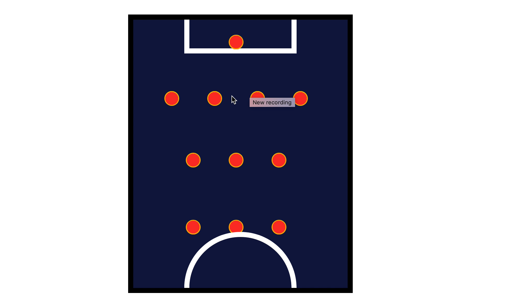

#Football Manager.    

URL DE VOTRE DEM0 sur now.sh : http://...

DEMO : https://football-manager-nggcz87u1.now.sh/

```javascript
const key = "eb7490e0ca3a3d75eab567df34d6b3bce6f747b8b30c8bdeee27f52a1ed3b150";
const url = "https://allsportsapi.com/api/football/?&met=Players&playerName=" + playerName + "&APIkey=" + key;
```



1. Créer un repo Github pour votre projet
2. Faire un schema de l'application (photoshop, etc)
3. Créer les composants
4. Croiser les doigts
